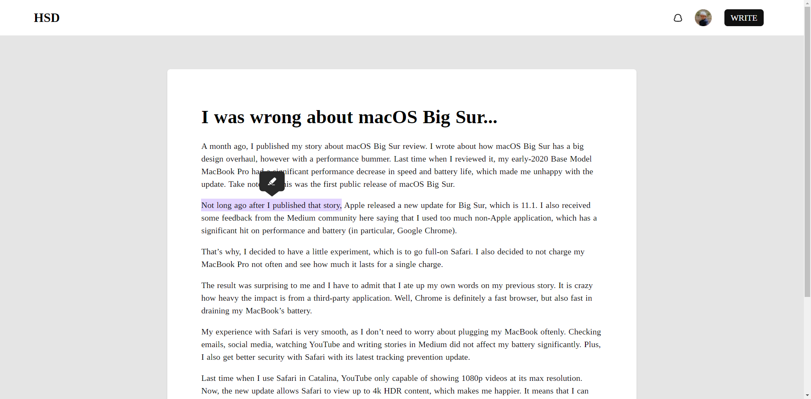

# Medium like text highlight

## Project URL
https://medium-text-highlight.netlify.app/

## Description
```
Selecting the text will show a popup with "pencil" icon, after clicking on icon it will show an alert with selected text.
```

## Screenshot


## Build Setup

```bash
# install dependencies
$ npm install

# serve with hot reload at localhost:3000
$ npm run dev

# build for production and launch server
$ npm run build
$ npm run start

# generate static project
$ npm run generate
```


For detailed explanation on how things work, check out [Nuxt.js docs](https://nuxtjs.org).
